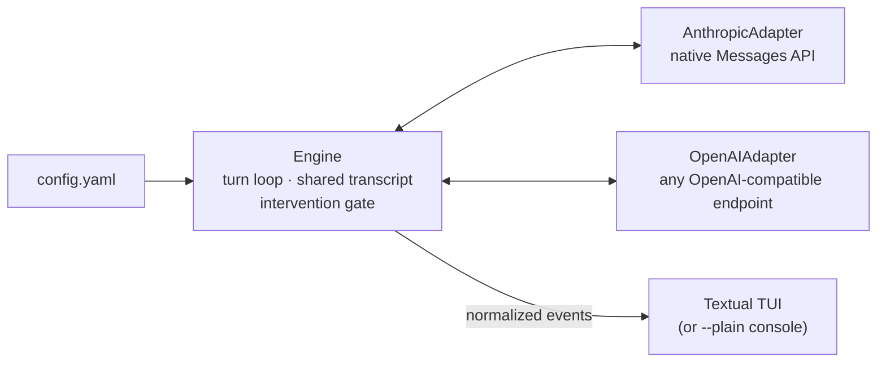

# dialecticus


**Think of it as a stress test for arguments.** You hand it a position (a
proposal, a paper, a plan, a chain of reasoning) and it puts that structure under
adversarial load: a second model working the same evidence, hunting for the joint
where the argument gives. It is the argumentative equivalent of load-testing
software before you trust it in production.

It is an idea-miner, not a citation source: the debate surfaces angles and
weaknesses worth investigating, but every claim it produces must be re-verified
against the original material before you rely on it.

The mechanism underneath is an evidence-grounded debate harness for language
models. Two models argue a topic
you scope, each claim cited back to a read-only corpus you point them at, while
you moderate live at turn boundaries. Mix a premium model and a free one in the
same room and pay only for the seat that matters.


https://github.com/user-attachments/assets/9bb82c05-5e6a-4ef3-abed-d4af03ec7c3f


## What makes it different

Plenty of projects let two bots talk past each other. dialecticus is built for the
cases where the conversation has to be **checkable** and **steerable**:

- **Grounded, not vibes.** Point a debate at a directory and each persona answers
  from the files, with a `file:line` citation you can re-open. ([details](#grounded-debate-read-only-file-access))
- **You moderate live.** Pause, single-step, inject, or toggle thinking, all at
  turn boundaries so intervening never tears a streaming reply in half. ([details](#tui-controls))
- **Mix premium and free in one room.** Native Anthropic plus one OpenAI-compatible
  adapter reaches everything else by `base_url`; per-speaker context budgeting and
  prompt caching keep only the expensive seat costing money. ([details](#context-budgeting))
- **Built to be left alone.** 429s are retried, a failed turn is isolated instead
  of crashing the run, and every session is persisted and exportable. ([details](#rate-limits-and-errors))
- **Idea-miner, not citation source.** The `file:line` citations keep the debate
  honest during the run, but models paraphrase and line numbers land near, not
  exact. Treat the output as a map of arguments worth checking, not as
  copy-pasteable evidence.

## How it works



One engine drives the turn loop and owns the shared transcript; two adapters
normalize every provider into the same event stream (`TurnStarted`,
`ThinkingDelta`, `TextDelta`, `TurnComplete`, `Injected`); the TUI and the
`--plain` console renderer both read that one stream. Provider coverage is the
whole story of those two adapters: native Anthropic for Claude, and an
OpenAI-compatible adapter family that reaches everything else (OpenAI, OpenRouter,
local servers, and gateway-specific subclasses for Z.AI and Gemini that override
thinking-parameter injection). See [Provider boundary](#adding-another-openai-compatible-gateway)
for what that covers and where it stops.

## Quickstart

```sh
pip install -e .
cp .env.example .env     # fill in the keys your personas need
```

Keys come from the environment or a local `.env` (loaded automatically). Point at
any persona YAML:

```sh
dialecticus personas.openrouter-free.yaml          # interactive TUI, free models
dialecticus personas.openrouter-free.yaml --plain  # plain console stream
```

The TUI **starts in step mode**: press `n` to advance one turn, `s` to switch to
continuous. Full key map under [TUI controls](#tui-controls).

## See the grounded debate work

The headline feature needs real files to show, so two self-contained demos ship in
the repo. Both run on free OpenRouter models (`OPENROUTER_API_KEY` only), so a full
run costs nothing:

```sh
dialecticus personas.zombie-debate.yaml   # debate over a small fictional corpus
dialecticus personas.self-review.yaml     # the tool debating its own source
```

- **`personas.zombie-debate.yaml`** points two models at `./demo-corpus`, five
  short fictional position papers, and has them argue "is a language model a
  philosophical zombie?" Each side defends its own paper, reads the shared evidence
  file, and must cite a `file:line` range. The philosophy is deliberately invented
  (echo-qualia, the lumen index); the point is to watch the locate-then-read loop
  run on files you can open yourself.
- **`personas.self-review.yaml`** points dialecticus at its own source tree and
  has two models argue whether the two-adapter design is the right provider
  boundary, citing the actual `dialecticus/providers/*.py` lines they read.
  Nothing here is fictional: the corpus is the package you just installed.

Both are the same machinery you would use on your own corpus: drop a `file_access`
block on a config and every persona gets read-only `list_files` / `search` /
`read_file` over that directory. The mechanics are documented in
[Grounded debate](#grounded-debate-read-only-file-access) below.

## Writing your own debate

A config is a topic, a kickoff, and a list of personas. `personas.example.yaml` is
the annotated template; the short version:

```yaml
topic: "Whether a model can be said to understand anything."
kickoff: "Open with your strongest claim."
max_turns: 6
show_thinking: true

personas:
  - name: Searle
    provider: anthropic
    model: claude-opus-4-8        # reads ANTHROPIC_API_KEY
    max_tokens: 1024
    identity: "You doubt that syntax ever amounts to understanding."
  - name: Dennett
    provider: openai              # any OpenAI-compatible endpoint
    model: deepseek/deepseek-r1
    base_url: https://openrouter.ai/api/v1
    api_key_env: OPENROUTER_API_KEY
    max_tokens: 1024
    identity: "You argue understanding just is the right information processing."
```

Two ready-made free-model pairings are included:
`personas.openrouter-free.yaml` (Meta Llama vs Alibaba Qwen, `OPENROUTER_API_KEY`)
and `personas.zen.yaml` (DeepSeek vs Qwen via [OpenCode Zen](https://opencode.ai/zen),
`OPENCODE_API_KEY`, more generous free rate limits).

---

The rest is reference: the file-access toolset, the keys, and the engine's cost,
context, and failure behaviour.

## Grounded debate (read-only file access)

Grant every persona read-only access to one directory and they get three tools,
`list_files`, `read_file`, and `search`, scoped to it:

```yaml
file_access:
  directory: ./shared      # relative paths resolve against the config file
```

The engine then runs the tool-call loop inside a turn: the model lists the
directory, locates the lines it cares about, reads those line ranges, and answers
from what it read, all within the same turn. Tool activity shows up dimmed inline
at the point in the reply where the model made the call
(`⚙ search("perspectivism")`), and is saved into the session record and Markdown
export.

The toolset mirrors a locate-then-read workflow:

- `list_files` lists every readable file with byte sizes.
- `search(pattern, path?)` does a literal, case-insensitive search and returns
  matching lines as `file:line: text`. It scans the whole directory by default;
  pass `path` to restrict it to one file.
- `read_file(path, offset?, limit?)` returns the file with every line numbered.
  `offset` (1-based start line) and `limit` (line count) page through a long file,
  and a trailing note reports the next offset to continue from. Reading around the
  line numbers `search` reports is the fast path into a large document.

Access is read-only and confined to the directory:

- There is no write/edit/delete tool; the adapters never open a file for writing.
- Paths that try to escape the directory, via `..` or a symlink pointing outside,
  are refused. Absolute paths are resolved against the directory, not the
  filesystem root.
- A single read returns at most 64 KB (and 400 lines by default), a listing at
  most 1000 entries, and a search at most 100 matches, so a large tree cannot blow
  the context budget.

Without a `file_access` block, no tools are offered and behaviour is unchanged.

## Adding another OpenAI-compatible gateway

The OpenAI adapter reaches any standard Chat Completions endpoint, so many new
gateways need nothing but config: set `base_url` and `api_key_env` on each persona.
OpenCode Zen is wired up this way (`base_url: https://opencode.ai/zen/v1`). One
caveat for Zen: only its DeepSeek / Qwen / MiniMax / GLM / Kimi / Grok models use
`/chat/completions`; its GPT models use `/responses` and Claude models use
`/messages`, which this adapter does not drive. Its `/models` list also omits
context windows, so Zen personas fall back to the default budget unless you set
`context_length:` yourself.

Some gateways need their own adapter subclass because their thinking mode uses
non-standard request parameters. Two live in the repo today:

- **[Z.AI](https://platform.zaiai.com)** — ZAIAdapter extends the OpenAI adapter to
  inject `thinking: {type: "enabled"}` via `extra_body` for GLM models.
- **[Gemini (Google AI Studio)](https://aistudio.google.com/apikey)** —
  GeminiAdapter extends the OpenAI adapter to wrap thinking parameters inside
  `extra_body.google.thinking_config`, which Gemini's OpenAI-compatible endpoint
  expects as a top-level JSON key.

Both use the same factory cache, streaming, tool-call, and token-management logic
as the base adapter — only `_thinking_request_params()` differs.

## TUI controls

| Key     | Action                                                      |
| ------- | ---------------------------------------------------------- |
| `space` | pause / resume (continuous mode)                           |
| `s`     | toggle single-step mode                                    |
| `n`     | advance one turn (in step mode)                            |
| `i`     | focus the input to inject a moderator message; `enter` sends, `esc` cancels |
| `t`     | toggle thinking display (applies to the next turn onward)  |
| `q`     | quit                                                       |

The session opens with an intro panel (the participants' full system prompts and
the kickoff) and starts in step mode. The status line shows the mode (`running` /
`paused` / `step` / `ended`), the turn count against `max_turns`, whether thinking
is on, and the key to switch modes.

## Context budgeting

Models have very different context windows (free OpenRouter models alone span
32k..1M), and the transcript grows every turn. So before each turn the engine trims
to fit *that speaker's* model:

- Each persona's window is resolved once at startup: a YAML `context_length`
  override wins, else OpenRouter's live `/models` catalog, else a small map of
  known Anthropic windows, else a conservative default.
- The budget is `context_length * 0.75 - max_tokens` (leaving room for output).
- Token counts are a heuristic estimate (~4 chars/token) with that safety margin,
  so no per-turn token-counting calls are needed.
- The system prompt and the kickoff are always kept; the oldest turns are dropped
  first, and the most recent turn is always kept.

Set `context_length:` on a persona to override the resolved window.

## Rate limits and errors

Free models in particular get rate-limited often, so a 429 no longer takes the
whole session down:

- A rate limit (HTTP 429) is retried automatically. The engine honours the
  provider's `Retry-After` header, or OpenRouter's nested `retry_after_seconds`,
  and otherwise backs off ~20s, capped at 60s. The TUI shows a `⟳ retrying in Ns`
  notice on the speaker's turn while it waits; `q` aborts a pending retry.
- After `max_retries` (default 5) the turn is given up on. A failed turn shows a
  red `✗` error line, records nothing in the transcript, and the loop moves on to
  the next speaker instead of crashing.
- Non-rate-limit errors (auth, bad request, ...) are shown the same way but are not
  retried.

`max_retries` and `max_retry_delay` are constructor arguments on `Engine`.

## Notes

- `show_thinking` streams reasoning **where the provider exposes it**. Anthropic
  models stream a summarized chain of thought; DeepSeek-style models stream
  `reasoning_content`; Z.AI GLM models inject `thinking: {type: "enabled"}` via
  `extra_body`; Gemini models wrap thinking parameters inside
  `extra_body.google.thinking_config`; OpenAI's o-series does not expose raw
  reasoning at all.
- Turn order is round-robin over `personas`; the loop stops at `max_turns`.
- `max_tokens` caps a reply. Setting it to `0` or `null` (or omitting it with no
  value) means **no cap**: the OpenAI adapter drops the parameter so the model can
  finish its reply instead of being truncated mid-sentence (or mid-reasoning).
  Output is then bounded only by the model's context window. The Anthropic API
  requires a cap, so an uncapped Anthropic persona falls back to 4096. If the key
  is absent entirely, a persona defaults to 1024.
